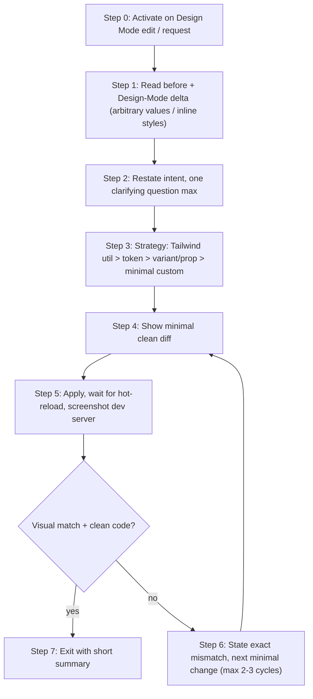

# Visual UI Layout Skill

Turn the slow, error-prone "tweak -> hope -> check -> tweak again" UI loop into a disciplined, measurement-driven, minimal-diff process that always prefers Tailwind utilities and existing design tokens.

## When to use this skill

Use this skill whenever the user has made (or wants to make) a visual layout change in Design Mode / Visual Editor and needs a clean code result. Typical triggers:

- The user dragged / resized / moved an element and says "apply this cleanly" or "make it match".
- Design Mode left behind arbitrary Tailwind values (`w-[327px]`, `ml-[23px]`, `gap-[7px]`) or inline styles (`style={{ marginTop: 15 }}`).
- The user asks to convert magic numbers into Tailwind scale values or design tokens.

Do NOT use this skill for building brand-new components from scratch, for non-layout logic changes, or for large refactors. It is scoped to translating a rough visual edit into a clean, minimal diff.

## Core principles

- Always capture the before state and the desired after state before touching code.
- Prefer Tailwind utilities and existing design tokens over arbitrary numbers.
- Generate the smallest possible clean diff.
- Verify the result after hot-reload, against the intended change.
- Offer a short refine loop (max 2-3 cycles) if the visual result is off.
- Keep every interaction short and decisive. Speed is the point.

## How "measurement" works in Cursor (read this first)

You cannot read live pixel geometry from the running page on your own. In practice, Cursor's Design Mode / Visual Editor writes the rough edit directly into the code as **arbitrary values** or **inline styles**. That encoded value IS your measurement.

- The pre-edit class (e.g. `max-w-sm`) is the **before**.
- The Design-Mode-produced arbitrary value (e.g. `max-w-[420px]`) is the **after / delta**.
- Your job is to rewrite that delta into the nearest Tailwind scale value or existing token, then confirm the rendered result still matches by viewing the running dev server (`http://localhost:3000`) — take or request a screenshot.

When no arbitrary value exists in code (the user only described the change verbally), restate your understanding of the delta and confirm it in one short message before proceeding.

See [references/tailwind-token-map.md](references/tailwind-token-map.md) for the exact px -> Tailwind scale and token conversions to use in Step 3.

## Strict workflow

### Step 0 - Activation & context capture
- Confirm the user is in (or just used) Design Mode / Visual Editor, or is explicitly asking to clean up a visual edit.
- Identify the selected element(s). Prefer a stable anchor (a `data-*` attribute, a unique className, or the component + prop) so you edit the right node.
- Capture the current "before" layout state: the relevant width/size, spacing, alignment, and position classes.

### Step 1 - Before / after measurement
- Record the precise before state (the existing classes/styles).
- Read the after state from the Design-Mode delta (arbitrary values / inline styles), or from the user's described intent.
- Compute the delta: exactly what needs to change, and nothing else.

### Step 2 - Confirm intent (keep it short)
- Restate the change in one line: e.g. "You widened the card from `max-w-sm` to ~420px and nudged it right ~24px. Correct?"
- Ask at most one clarifying question, and only if the edit is genuinely ambiguous. Never guess silently; never start a long conversation.

### Step 3 - Decide strategy
Choose the cleanest approach, in this order of preference:
1. Pure Tailwind utilities on the existing scale (spacing, width, flex/grid, alignment).
2. Existing design tokens / theme values (e.g. `bg-primary`, `bg-primary-soft`, `border-primary-border`, `text-accent-foreground`, radius scale).
3. Existing component props / variants (e.g. a Button `variant`/`size`) instead of ad-hoc classes.
4. Only as a last resort: a minimal custom / arbitrary value — and say why nothing else fit.

Never introduce inline styles, new CSS, or magic numbers when a scale value or token already expresses the intent.

### Step 4 - Generate the minimal clean diff
- Produce the exact, smallest change needed — minimal, readable, Tailwind-first, token-aware.
- Show the diff clearly before applying it (unless the user has already said "just do it").
- Do not reorder, reformat, or touch unrelated classes or lines.

### Step 5 - Apply & verify
- Apply the change.
- Wait for hot-reload to finish.
- Re-check the rendered result against the intended after state: view the dev server and take/request a screenshot, or ask the user to confirm the visual result.

### Step 6 - Refine loop (only when needed)
- If the result is off, state the remaining mismatch precisely: e.g. "Still ~8px too narrow."
- Propose the next single minimal adjustment and repeat Steps 4-5.
- Cap at 2-3 refine cycles. If still off after that, stop and ask the user for clearer guidance instead of looping.

### Step 7 - Exit
- Exit cleanly once the visual result is correct and the code is clean.
- Leave a short summary: what changed and why those Tailwind classes / tokens were chosen.

## Outcome handling

| Outcome | Action |
| --- | --- |
| Visual match + clean code | Declare success. Offer "anything else?" |
| Visual match but code not ideal | Offer a short clean-up refinement |
| Visual not matching | Enter the refine loop (Step 6) |
| User rejects the diff | Ask what was wrong, then restart from Step 2 |

## Rules you must always follow

- Never apply large or messy changes.
- Never introduce an arbitrary pixel value if a Tailwind scale value or token exists.
- Never add inline styles or new CSS unless absolutely necessary — and justify it if you do.
- Always show the diff before applying (unless the user pre-approved "just do it").
- Always prefer the smallest possible change that achieves the visual goal.
- Keep every response short and decisive.
- If the rough visual edit is ambiguous, ask one clarifying question instead of guessing.

## Workflow at a glance

## Worked examples

See the [examples/](examples/) folder for concrete before/after diffs against a real Next.js + Tailwind + shadcn/ui playground:

- [examples/resize-card.md](examples/resize-card.md) - widen a card: `max-w-[420px]` -> `max-w-md`
- [examples/alignment-strip.md](examples/alignment-strip.md) - fix a row's spacing/alignment: `gap-[7px]` / `ml-[9px]` -> `gap-2` / `ml-2`
- [examples/spacing-stack.md](examples/spacing-stack.md) - clean up a spacing nudge: `mt-[15px]` -> `mt-4`
